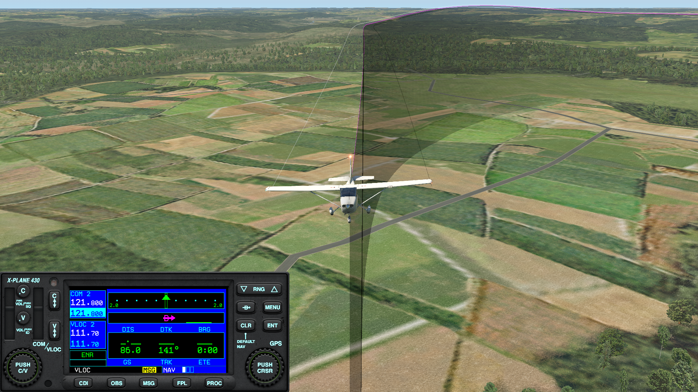
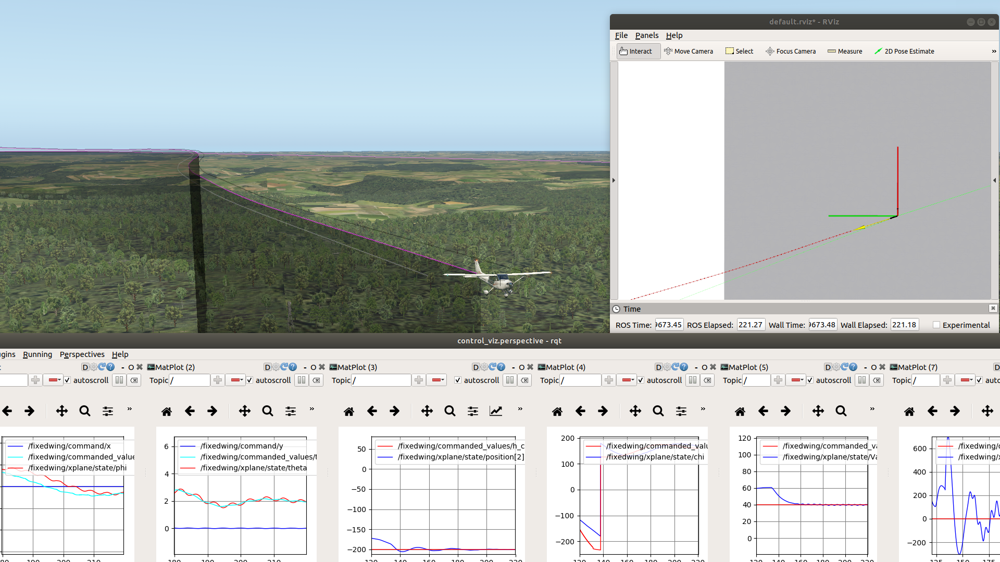
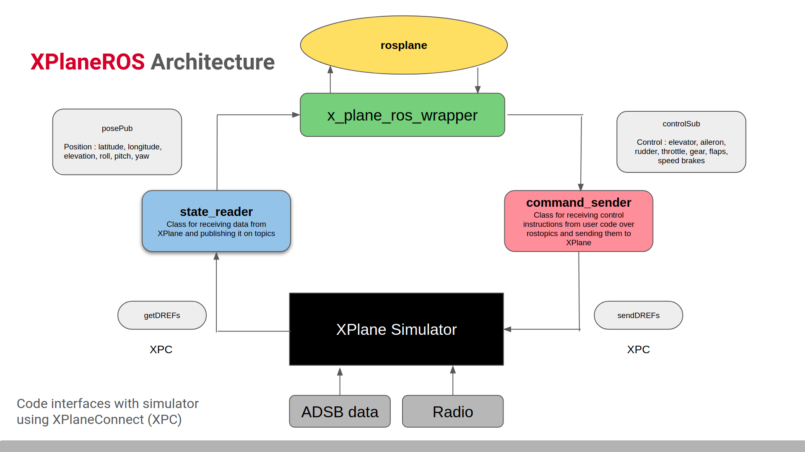
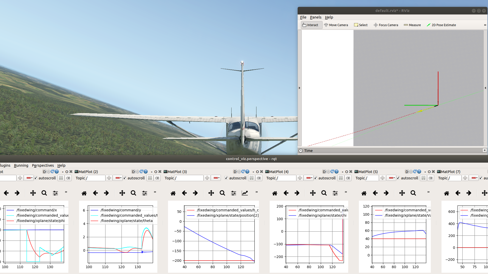

# XPlaneROS : ROS Wrapper for Autonomous Fixed Wing Applications and Learning using Realistic Dynamics

<!--   -->

  

Research in Autonomous Vehicles has boomed a lot, with a huge push towards self-driving cars and autonomous robots. Another interesting use case is life-size Autonomous Fixed Wing aircrafts which could be used in a number of places. Here we try to take a step in that direction by getting some architecture in place.  

As is the case with such systems, we need to be sure about the safety of models and algorithms before deploying them in the real world. There exist realistic simulators for testing driving cars (CARLA) and autonomous drones (AirSim) which make the whole process much more efficient and safe. However, for fixed-wing aircrafts, the testbeds haven't quite caught on. 

Recent research work in the lab related to Imitation Learning and Social Navigation for aircrafts neccesitated a proper way to test these algorithms in realistic conditions. A number of realistic flight simulators exist in the market like **Microsoft Flight Simulator** and **X-Plane** but without much proper ROS integrations. 

Here, we developed tools for this very purpose. We chose **X-Plane 11** as the simulator since it is compatible on multiple Operating Systems and provides a lot of realistic options of aircrafts and visuals.  
  

 

**XPlaneROS** is the ROS wrapper which interfaces with the simulator using NASA's XPlaneConnect. Once this is running, the user doesn't need to worry about getting into the workings and can simply take up the useful information from existing messages published over ROS topics.

 

In addition, we decided to integrate **ROSPlane** with **XPlaneROS** for the controllers. A whole traffic-pattern following was run using the path following algorithms and PID controllers. There have been some extensions to ROSPlane like employing a proper takeoff, additional control loops for vertical velocity rates and a rudimentary landing sequence. 

Tuning the controllers can also be challenging and slow. To tackle this, a simple GUI utility is available via which users can give specific commands for roll, pitch etc and can tune the PID paramters based on the performance.   

 

There are efforts underway to use this system along with a Behaviour Cloning framework and a native Trajectory Library. We hope this tool also becomes useful to other researchers out there wanting to try out Learning-based approaches for autonomous aircrafts. The ROS integration is an added benefit which allows people to go beyond only Learning and use the trained algorithms within a whole system.