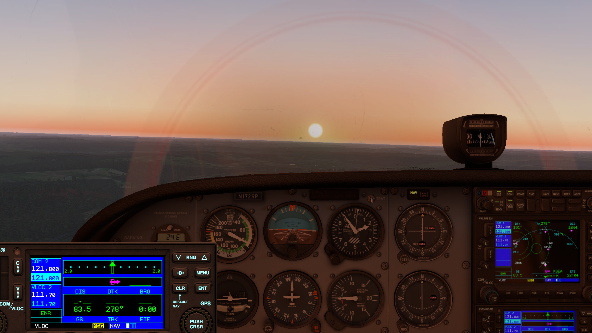
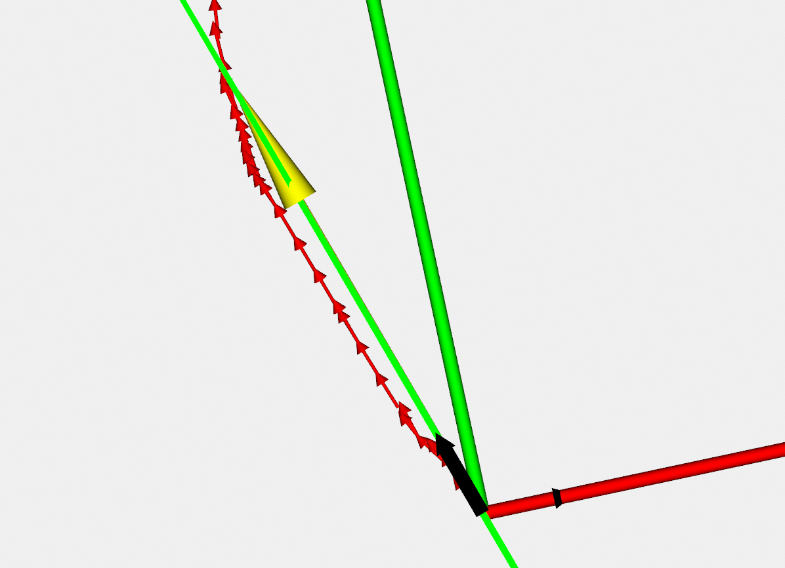
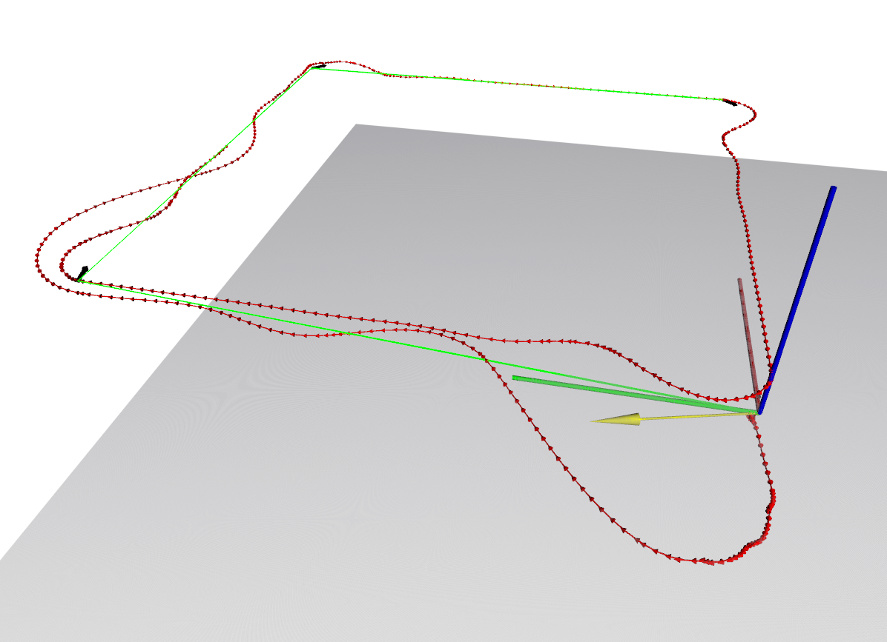

# XPlaneROS
 


**XPlaneROS** is a ROS wrapper for the XPlane-11 flight simulator. The wrapper provides functionality for extracting aircraft data from the simulator and feeding control commands to control the aircraft in the simulator.   
The main advantage is due to the fact that XPlane is a realistic simulator and thereby provides more realistic dynamics, responses and images.  
  

XPlaneROS interfaces with XPlane simulator using the [XPlaneConnect](https://github.com/nasa/XPlaneConnect) plugin.

# Compatibility 
XPlaneROS has been tested with the following systems/versions :
```bash
Ubuntu 18.04 
ROS-Melodic
XPlane-11.50
Python 3
```

The specs of the system are given as follows:
```bash
Processor : Intel® Core™ i7-10750H CPU @ 2.60GHz × 12 
Graphics  : GeForce GTX 1660 Ti/PCIe/SSE2
OS Type   : 64-bit
RAM       : 15.4 GiB
```

There's a possibility that if the system does not have enough computational power, then it can decrease the frame rate in XPlane and can lead to the system getting stuck. We noticed that the XPC interface crashes in that case.

# Setup 
There are three main components needed to run XPlaneRos: Xplane-11, XPlaneConnect, and [ROSplane](https://github.com/byu-magicc/rosplane). 

## XPlane-11 Setup
Install the XPlane-11 simulator.

## XPlaneConnect Setup
First we need to install the XPlaneConnect (XPC) plugin. Follow the steps give in the [XPlaneConnect](https://github.com/nasa/XPlaneConnect) repository or in their [Getting Started](https://github.com/nasa/XPlaneConnect/wiki/Getting-Started) page.  

Try to use the pre-compiled binary they provide. After following the steps mentioned in the repo, open XPlane and start a flight. If you see the plugin under the Plugin Admin, try running some of the example codes given in XPlane Connect (basicExample.py or monitorExample.py in the Python3/src folder).

If these are running you are good to go. If not, try the fixes mentioned below.

### XPlaneConnect Fixes
There is a chance the plugin might not have loaded correctly. If you don't see the plugin under the Plugin Admin while running XPlane, check the `Log.txt` file in the `XPlane-11` directory.  
  
If you received the error
`dlerror:/home/<username>/X-Plane 11/Resources/plugins/XPlaneConnect/lin.xpl: wrong ELF class: ELFCLASS32`, this is probably an OS compatibility issue with the pre-built binaries.
[#151](https://github.com/nasa/XPlaneConnect/issues/151)  


You will need to clone the XPC repo and build yourself. Go to ```XPlaneConnect/xpcPlugin``` within the cloned repo and run the commands 
```
mkdir build 
cd build
cmake .. 
cmake --build .
```  

When building, if the compiler could not find `bits/c++config.h` file, then run the following command.    
`sudo apt-get install gcc-multilib g++-multilib`

Building will create new .xpl files under a folder named ```XPlaneConnect``` in the `build` directory. Replace the old .xpl in the `XPlaneConnect` folder in the plugins of XPlane.

After building and replacing the .xpl, if you get the error
`dlerror:/home/<username>/X-Plane 11/Resources/plugins/XPlaneConnect/64/lin.xpl: undefined symbol: _ZN3XPC15MessageHandlers21CamCallback_RunwayCamEP20XPLMCameraPosition_tiPv`, the try resolving this by adding ```CameraCallbacks.cpp``` in the ```CMakeLists.txt``` in both the ```add_library``` commands.  

## ROSplane Setup

**Prerequisites**

1. If not already done so, install [ROS](http://wiki.ros.org/ROS/Installation) (Desktop-Full is recommended).

2. If not already done so, create a catkin workspace with [catkin tools](https://catkin-tools.readthedocs.io/en/latest/):
```bash
sudo apt-get install python-catkin-tools
mkdir -p ~/xplane_ros_ws/src
cd ~/xplane_ros_ws
catkin init
```

<!-- xplane_ros will also require you to have [rosplane](https://github.com/byu-magicc/rosplane) installed in your local machine.   (Use the [xplane/main](https://bitbucket.org/castacks/rosplane/src/85e8b590c02e03bfe2679235775a28d9c9b2607c/?at=xplane%2Fmain) branch).   -->


After that we will install our fork of ROSplane:
```bash
cd ~/xplane_ros_ws/src
git clone -b xplane/main git@github.com:castacks/rosplane.git 
git clone https://github.com/byu-magicc/rosflight_plugins.git
git clone https://github.com/rosflight/rosflight.git
cd rosflight/
git submodule update --init --recursive
```

As a sanity check, try building running the ROSplane code once along with gazebo (you may also need to install eigen_stl_containers with `sudo apt-get install ros-melodic-eigen-stl-containers`). 
```bash
catkin build
source ~/xplane_ros_ws/devel/setup.bash
roslaunch rosplane_sim fixedwing.launch
```
Once Gazebo launches, you can press the "play" button in the bottom left corner, and the fixedwing should take off. 

For convenience, you can add the `source ~/xplane_ros_ws/devel/setup.bash` statement in your `~/.bashrc` file.

Now! You've checked out ROSplane and finally we're ready to move onto XPlaneROS!  

## XPlaneROS Setup

**Installation**

1. Move to your catkin workspace: 
```bash
cd ~/xplane_ros_ws/src
```  

2. Install system dependencies:  
```bash
sudo apt-get install python-wstool python-catkin-tools
```  


3. Download repo using a SSH key or via HTTPS: 
```bash
git clone git@github.com:castacks/xplane_ros.git # SSH
git clone https://github.com/castacks/xplane_ros.git # HTTPS
```  

4. Source and compile: 
```bash
catkin build
source ~/xplane_ros_ws/devel/setup.bash
```  


# Running XPlaneROS 

1. Open X-Plane 11 (`X-Plane 11/X-Plane_x86_64`).  
2. Select **New Flight**.  
3. In the LOCATION panel, set the location to Butler airport (ID : KBTP) with Runway 26.  
4. Click **Start Flight**.  

You can then start XPlaneROS with 

```bash
roslaunch xplane_ros default.launch
```  

The `default.launch` provides the bare-minimum structure in order to interface with XPlane. The `xplane_ros_wrapper` node will provide the odometry data from XPlane and it will listen to Xplane commands from the user application on the topic `/xplane/my_control` and then send them to XPlane.  


The `default.launch` file also has a launch command for the rviz visualization. Uncomment that to load a `.perspective` file with a top down visualization of the odometry.

## Troubleshooting XPlaneROS
Here we provide solutions for some issues you might encounter.   
1. eigen-stl-containers are missing :
```bash
sudo apt install ros-melodic-eigen-stl-containers
```

2. Build error which says CMAKE path does not have 'rosplane'
```bash
catkin build --continue-on-failure
```
You might have to run this command twice 

3. module export error related to python
If you're running it on Melodic using Python2.7, then try to modify the shebang in xplane_ros with this : 
```bash
#! /usr/bin/env python2.7
```

# Running XPlaneROS with ROSplane  
```(Assumes familiarity with ROSplane)```  
`StateReader.py` also packs data in the format needed for ROSplane and publishes that. You can run the ROSplane controller along with xplane_ros by running :   

```bash
cd ~/xplane_ros_ws/src/xplane_ros
bash utils/pattern_following.sh
```  
This will run the `default.launch` and `xplane_fw.launch` file. The plane will takeoff and start the pattern following.

In case you want to try tuning some of the control loops while following the pattern, the rqt_reconfigure will be opened by the launch file. You can tweak the parameters there.

Press the `Refresh` button incase you don't see anything. 
After that the relevant config parameters should be visible once you click on `fixedwing/autopilot` (for PID controls) and `fixedwing/pathfollower` (for vector field parameters).

<!--  -->
 
<!--  -->
 

# Tuning ROSplane Parameters 
We have tuned the parameters for Cessna_172 (the default aircraft in XPlane) but feel free to try it out for other aircraft yourself.  

```bash
roslaunch xplane_ros default.launch rosplane_tuner:=true
```  

Under the `rqt_reconfigure gui` you should see `fixedwing` and `xplane_ros `. Click on both of them.  
The `fixedwing` setup contains the dynamic reconfigure for `rosplane` parameters. The nomenclature should be obvious once you take a glance at the `params` and `cfg` files provided in `rosplane`. Those are the tuning parameters for the PID loops implemented in `rosplane`.    

The `xplane_ros` portion of the gui provides a kind of easy-to-use interface for you to give certain commands and see the response.   
For example, suppose you want to tune the `roll attitude` parameters. Tick the `hold_roll` box and untick the other boxes. This means that the `autopilot_tuner` node will ignore all the other commanded values and will only run the `roll_hold()` function to set the current `phi` to `phi_c`. You can set the value for `phi_c` using the `roll_step` in the `rqt_reconfigure` gui.   
In the `rqt_plot` you will be able to visualise the **commanded roll**, **current roll** and also the **aileron** commands output by the `roll_hold()` function.  

NOTE : The control surfaces correponding to the unticked boxes will be defaulted to what it was just before you unticked them. 

Henceforth, you should be able to experiment with other control loops like `pitch`, `heading`, `throttle`, etc (each corresponding to a function in `controller_base.cpp` and `controller_example.cpp` in `rosplane`).   

For some more idea about what each code does, head over [here](https://bitbucket.org/castacks/xplane_ros/src/master/scripts/).
